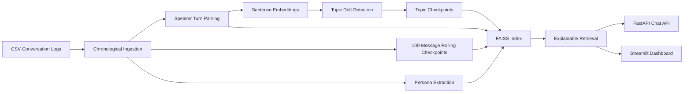
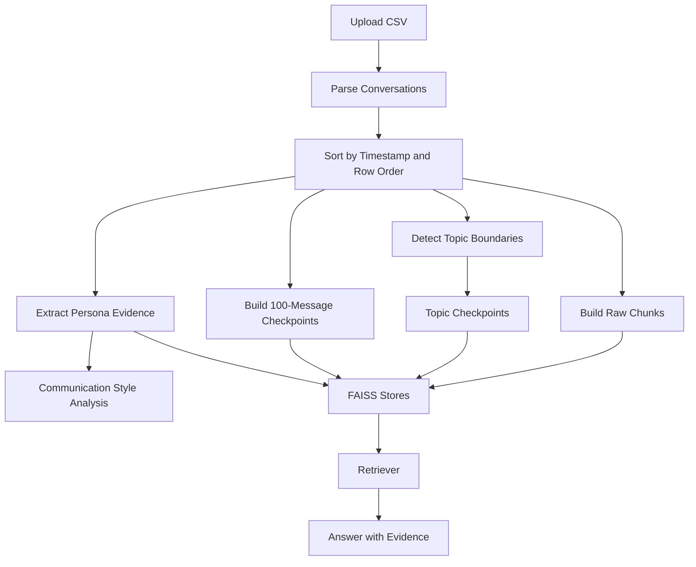

# Intelligent Conversational Memory System

An end-to-end AI memory architecture that processes conversation logs chronologically, detects topic changes with sentence embeddings, builds hierarchical memory checkpoints, extracts explicit persona evidence, and supports explainable retrieval through FAISS-backed RAG.

## What This Project Demonstrates

- Chronological conversation ingestion from CSV logs
- Topic segmentation using `sentence-transformers` and sliding semantic windows
- Topic checkpoints and 100-message rolling checkpoints
- Hierarchical memory design
- Explicit-evidence persona extraction
- Communication style analytics
- FAISS retrieval across raw chunks, topics, checkpoints, and persona memory
- FastAPI backend and Streamlit dashboard
- Render-ready deployment configuration

## Folder Structure

```text
app/
  api/
  analysis/
  chatbot/
  core/
  ingestion/
  memory/
  retrieval/
  ui/
  utils/
data/
  sample/
artifacts/
examples/
screenshots/
tests/
```

## Architecture Diagram



## Data Flow Diagram



## Topic Detection Methodology

1. Each message is embedded with `all-MiniLM-L6-v2`.
2. A sliding window compares the previous 10 messages with the next 10 messages.
3. The centroids of the two windows are compared with cosine similarity.
4. Topic boundaries are emitted when semantic drift rises above the adaptive threshold and the boundary is a local drift peak.
5. Each boundary includes a confidence score and a human-readable reason.

This avoids treating the full transcript as a single document and makes topic structure explicit.

## Persona Extraction Methodology

Persona extraction is evidence-only.

The system scans messages from the target speaker for explicit statements that support:

- Habits
- Personal facts
- Interests
- Goals
- Personality traits
- Communication style
- Recurring behaviors

Every persona item stores:

- Value
- Evidence
- Confidence

If the text does not support a claim directly, the system does not invent one.

## Memory Hierarchy Design

- Level 1: Raw conversation chunks
- Level 2: Topic summaries
- Level 3: 100-message summaries
- Level 4: Persona memory

This mirrors long-term assistant memory by keeping both fine-grained and compressed representations of the same conversation history.

## Retrieval Pipeline

1. Search topic summaries
2. Search raw chunks
3. Search 100-message checkpoints
4. Search persona memory
5. Merge the retrieved context
6. Return an evidence-backed answer with source attribution

The API returns structured retrieval metadata so every answer can be traced back to its memory sources.

## Evaluation Strategy

Suggested evaluation metrics for internship review:

- Topic boundary quality: manual boundary precision and recall
- Persona precision: supported evidence only, no unsupported claims
- Retrieval relevance: top-k hit precision
- Coverage: percentage of conversations assigned to topics and checkpoints
- Explainability: evidence presence in all chatbot answers
- Style analysis stability: consistency across similar speakers

## Deployment Steps

### Local

1. Install dependencies from `requirements.txt`.
2. Place your dataset in `data/sample/conversations.csv` or upload via the app.
3. Run the backend:

```bash
uvicorn app.main:app --reload
```

4. Run the Streamlit dashboard:

```bash
streamlit run app/ui/streamlit_app.py
```

### Render

- Use `render.yaml` for deployment.
- The Docker image starts the FastAPI backend by default.
- For Streamlit, point a separate service at `streamlit run app/ui/streamlit_app.py --server.port $PORT`.

## Screenshots

Add exported screenshots into the `screenshots/` folder. Recommended pages:

- Dashboard
- Topic Timeline
- Persona Explorer
- Memory Checkpoints
- Retrieval Inspector
- Chatbot

## Sample Outputs

See `examples/sample_outputs.json` for example topic, persona, and chatbot outputs.

## Future Improvements

- Add a generative LLM layer for richer answer synthesis
- Add better named-entity extraction with spaCy or a transformer NER model
- Add per-speaker memory views and comparison mode
- Persist FAISS stores and artifacts in object storage
- Add automated evaluation scripts and benchmark datasets
- Add a richer topic transition graph visualization

## Notes on the Dataset

This project is tuned for conversation CSVs where each row contains a quoted transcript block. If a `date` column exists, rows are sorted chronologically. If it does not, the row order is used as the chronology signal.

## Quick Start

```bash
pip install -r requirements.txt
uvicorn app.main:app --reload
streamlit run app/ui/streamlit_app.py
```
